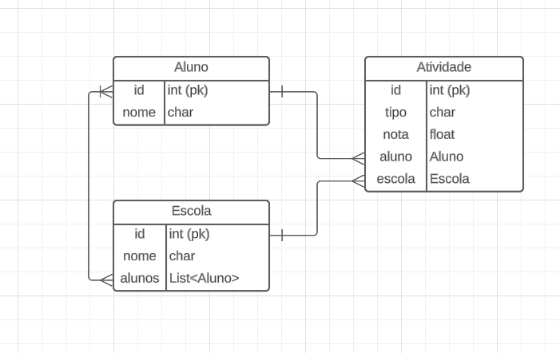

# DNC

## Visão Geral do Projeto

Este é um projeto que usa:
Front - Vue, Javascript, Vite e Vuetify
Back - Django, Python
Banco - PostgreSQL
É uma stack de desenvolvimento web moderna que é rápida e eficiente para construir aplicativos web escaláveis.

## Preview

O projeto permite adicionar alunos à base do projeto, associar notas em suas tarefas, desafios e projetos e mostra ao usuário quem são os top 3 alunos de todos as Escolas e o top 10 alunos de cada Escola.

### Telas

#### Home

### MER



## Começando

Para iniciar o projeto, siga os passos abaixo:

- Clone o repositório em sua máquina local

Front:

- Vá até a pasta `front`
- Execute `npm install` para instalar as dependências do projeto (utilizado node v20.1.0 e npm v9.6.6)
- Execute `npm run dev` para iniciar o servidor de desenvolvimento

Back:

- docker-compose exec web python manage.py migrate (migrar dentro do docker)
- sudo service postgresql start (pra subir postgres local e rodar pytest)
- Vá até a pasta `back`
- Crie uma virtualenv com python (utilizado 3.10.11)
- Rode `python -r requirements.py` para instalar as dependências
- Rode `python manage.py migrate` para aplicação dos modelos no ambiente local
- Execute `python manage.py runserver`

- Abra seu navegador e acesse `http://localhost:5173/` para ver a aplicação funcionando

## Estrutura de pasta (TODO)

```
├── dist                   # Arquivos compilados
├── public                 # Assets públicos
├── src                    # Código fonte
│   ├── api                # API (nesse caso mock da API)
│   ├── assets             # Assets estáticos
│   │   ├── styles         # Estilos gerais
│   ├── commons            # Códigos reutilizáveis
│   ├── components         # Componentes reutilizáveis
|   |   ├── tests          # Testes unitários dos componentes usando Vitest
│   ├── contexts           # Separação de contexts
│   ├── pages              # Componentes de página
│   ├── App.vue            # Componente raiz
│   └── main.ts            # Entry point
├── tsconfig.json          # Configuração do TypeScript
├── package.json           # Dependências e scripts
├── vite.config.ts         # Configuração do Vite
└── README.md              # Documentação do projeto
```

## Tecnologias e Funcionalidades (TODO)

### Tecnologias

O projeto inclui as seguintes tecnologias:

Front:

- Vue para reatividade.
- Javascript para escalabilidade.
- Vite para desenvolvimento e construção rápidos e eficientes
- Vuetify como biblioteca para UI.
- Axios para chamadas HTTP.

Back:

- Django para
- Python para
- PostgreSQL para

### Funcionalidades

O projeto possui as seguintes funcionalidades:

- Componentes Funcionais
- Eventos

## Scripts (TODO)

O projeto inclui os seguintes scripts:

Front:

- `npm run dev`: Inicia o servidor de desenvolvimento
- `npm run build`: Builda o aplicativo pronto para produção
- `npm run lint`: Linta e corrige os arquivos

Back:

-
